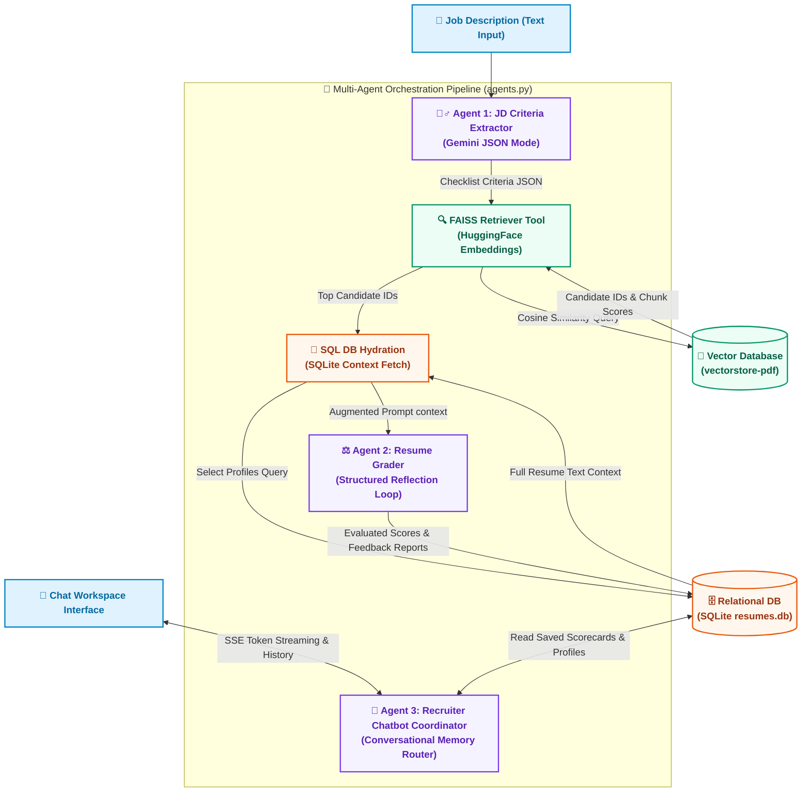

# Enterprise AI Recruiter: Multi-Agent RAG Screening System

An advanced **Multi-Agent RAG Pipeline** designed for high-performance applicant screening. The system parses, extracts, indexes, and grades resume profiles against unstructured Job Descriptions (JDs) using a collaborative team of specialized AI agents.

---

## 🏗️ GenAI & Agentic AI Architecture

This project is built around an advanced **Multi-Agent Workflow** integrated with a **Retrieval-Augmented Generation (RAG)** pipeline. The complete data routing, database memory hydration, and agentic loop mechanics are mapped below:



---

## 🔁 Complete System Pipelines

### 1. Ingestion Pipeline (Data Loading)
When resumes are uploaded, they are indexed into the system using a dual-write mechanism:
1.  **Text Extraction**: A PDF parser (`pypdf`) or CSV reader extracts raw text.
2.  **SQL Persistence**: Basic candidate records (ID, name, email, full resume text) are saved into SQLite database rows.
3.  **Vector Indexing**: Text is split into 1024-character chunks (with 500-character overlap) via `RecursiveCharacterTextSplitter`. These chunks are embedded using local SentenceTransformer models and stored in the **FAISS index** mapped to their respective `Candidate ID` metadata tags.

### 2. Screening Pipeline (Orchestrated Grading)
When the recruiter runs the screener against a Job Description:
*   **Step 1: Requirements Extraction**: **Agent 1** translates the JD into a structured JSON configuration of required skills, preferred qualifications, and minimum years of experience.
*   **Step 2: Vector Routing**: The JD criteria embedding vector is queried against the **FAISS Vector Index** to retrieve the Candidate IDs of candidates matching the semantic profile.
*   **Step 3: Relational Hydration**: The system queries SQLite using the Candidate IDs to retrieve the **full candidate records** and continuous resume texts (preventing context fragmentation).
*   **Step 4: Evaluation Loop**: **Agent 2** grades each candidate resume against the criteria checklist. The scores (Skills, Experience, Education, Overall) and evaluation feedback reports are written back to SQLite.

### 3. Q&A Pipeline (Chat Coordination)
When you ask the AI Recruiter conversational comparative questions:
*   **Agent 3** reads the query and history.
*   It pulls the active candidate evaluations, reports, and resumes from SQLite.
*   It formats this as contextual reference paragraphs inside the prompt instructions, enabling Gemini to answer recruiter queries accurately without hallucinations.

---

## 🤖 Agentic AI Principles Implemented

*   **Task Decomposition**: Breaks complex screening tasks into sequential stages, maintaining specialized instructions at every step (Extraction -> Retrieval -> Grading).
*   **Tool Integration (RAG)**: Integrates FAISS similarity scoring for semantic candidate discovery.
*   **Persistent State Memory**: Integrates a SQLite database to save computed grades and evaluation summaries, providing context persistence across browser sessions and chat logs.

---

## 🚀 Installation & Local Setup

### Prerequisites
*   Python 3.10+
*   Node.js 18+
*   Google Gemini API Key

### Step 1: Backend Setup
1.  Navigate to the `backend` directory:
    ```bash
    cd backend
    ```
2.  Create and activate a virtual environment:
    ```bash
    python -m venv venv
    # Windows:
    .\venv\Scripts\activate
    # macOS/Linux:
    source venv/bin/activate
    ```
3.  Install dependencies:
    ```bash
    pip install -r requirements.txt
    ```
4.  Configure your environment. Create a `.env` file inside the root directory or `backend` folder:
    ```env
    # Google Gemini API Key configuration
    GEMINI_API_KEY=your_gemini_api_key_here
    ```
5.  Start the FastAPI server:
    ```bash
    python -m uvicorn main:app --host 127.0.0.1 --port 8000 --reload
    ```
    *Note: The server will automatically initialize and seed the SQLite database with 228 demo candidates on first startup.*

### Step 2: Frontend Setup
1.  Open a new terminal and navigate to the `frontend` directory:
    ```bash
    cd frontend
    ```
2.  Install packages:
    ```bash
    npm install
    ```
3.  Start the developer server:
    ```bash
    npm run dev
    ```
4.  Open your browser and navigate to `http://localhost:5173`.
